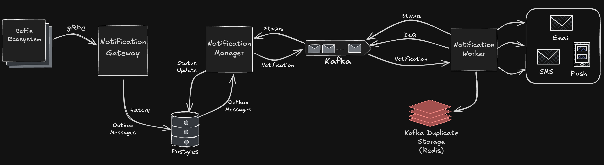

# Notification System

It is a notification system that provides **reliable** and **flexible** message delivery with the ability to receive a history and view the status of sending. 

The system consists of several microservices working together to process, send, and track notifications.

## Features

* **Reliable delivery**: **The outbox pattern** ensures atomicity of operations within the system, while **Kafka** ensures reliable message transmission across the system.

* **Gateway**: The gateway provides **gRPC** methods for working with the full cycle of sending notifications: from creating a query to receiving a query history.

* **History**: The system provides a complete notification history and status:

    * Getting a list of queries.
    * Getting all the query data (content, metadata, etc.).
    * Getting the notification status for each individual recipient (The query supports sending a message to multiple recipients).

* **Scheduled sending**: The system provides the possibility of sending scheduled notifications. The system also provides a way to cancel sending a notification if it is scheduled to be sent (if the time for sending has not yet passed). Canceling a sending can be useful if, for example, plans have changed and the sending is no longer needed. Another possible case where you may need to cancel a sending is **SAGA**: you can make a scheduled sending and cancel the sending in the case of a compensating transaction.

* **Gateway Idempotence**: Gateway supports idempotence keys (UUID identifiers) to ignore duplicate queries. This allows you to implement things like the retry logic of interacting with the gateway without worrying about duplicate sending the notification.

## Architecture and Components

The system includes the following microservices:

* [**Gateway**](https://github.com/coffee-proj/notification-gateway) — receives notification requests via **gRPC**.

* [**Manager**](https://github.com/coffee-proj/notification-manager) — reads pending notifications from the outbox table in **PostgreSQL** and publishes them to **Kafka**. It also listens for delivery status updates.

* [**Worker**](https://github.com/coffee-proj/notification-worker) — consumes notification messages from **Kafka**, sends the notifications, and publishes delivery status messages back to **Kafka**.

The interaction of the services is shown in the picture below:

    </img>

## How It Works

1. Client creates a notification query using the gRPC method provided by Gateway.

2. Gateway writes the query to the outbox table in PostgreSQL and saves the history in one transaction.

3. Manager reads messages from the outbox table and publishes them to Kafka.

4. Worker consumes messages from Kafka, sends a notification (for example, by e-mail), then publishes a message about the status of sending (COMPLETED or ERROR and a message explaining the status) to Kafka.

5. Manager consumes messages about the status of sending and updates the notification status in PostgreSQL.

6. The client can interact with queries via the Gateway, for example, to get their history.

## Participation in the project

If you want to participate in the project, please contact our team:

Team

#### Nikita

  

#### Artem

  

