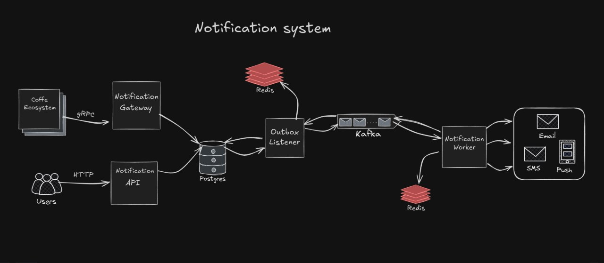

# Notification System

This is a notification system implementing the Outbox pattern to ensure reliable and consistent message delivery. The system consists of several microservices working together to process, send, and track notifications.

## Features

• Reliable notification delivery using the Outbox pattern and Kafka.

• Support for multiple transport protocols (gRPC and HTTP).

• Ability to retrieve full notification history with statuses.

## Architecture and Components

The system includes the following microservices:

• gRPC Gateway — receives notification requests via gRPC.

• Public HTTP Gateway — receives notification requests via HTTP.

• Outbox Listener — reads pending notifications from the outbox table in PostgreSQL and publishes them to Kafka. It also listens for delivery status updates.

• Worker — consumes notification messages from Kafka, sends the notifications, and publishes delivery status messages back to Kafka.

The interaction of the services is shown in the picture below:

    </img>

## How It Works

1. A client sends a notification request to either the gRPC or HTTP gateway.

2. The gateway writes the request into the outbox table in PostgreSQL and saves the notification history.

3. The Outbox Listener reads new entries from the outbox table and publishes them as messages to a Kafka topic.

4. The Worker consumes messages from Kafka, sends the actual notifications (e.g., email, SMS, push), then publishes a delivery status message (success, failure, error details) back to a different Kafka topic.

5. The Outbox Listener listens to the status topic, updates the notification history in PostgreSQL accordingly.

6. Users can query the notification history and their statuses through either of the gateways.
